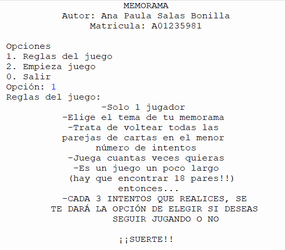
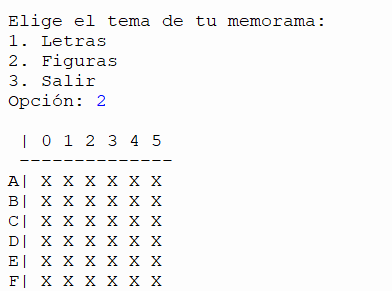
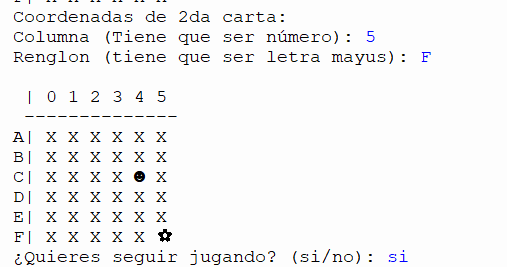
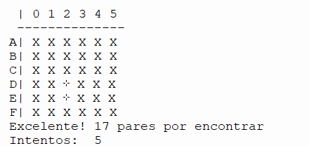

<!-- markdownlint-disable MD041 MD002 -->

  <h1>Python-memory-game🧩</h1>
  <strong>6x6 Python memory game where players can choose between matching pairs of figures or letters of the alphabet.</strong> 
   
  <strong>Built by Ana Paula Salas</strong>

 
<h1>  </h1>

 You can choose your preferred mode, uncover pairs, and challenge yourself to beat your own high score in this fun Python memory game.
(Game is in spanish, translation is in progress...)
 
  
## Required libraries

-random
 
-sys

## Skills

-Conditionals
 
-Functions
 
-Loops
 
-Python programming
 
-Github tools
 

## Images
<em> Rules </em>  

<em> Choose theme </em>  

<em> Start playing </em>  

<em> Found  a pair! </em>  

